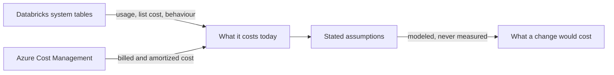

# databricks-cost-optimizer

A read-only agent skill that works out what a specific Azure Databricks workload costs today, then
designs a way to make it cost less.

You point it at one thing — a job, a pipeline, a SQL warehouse, a team's workload — and it reads
your usage and billing data to establish what that thing actually costs. It then proposes concrete
changes. Each one comes with the evidence behind it, what you save, what the change costs to make,
what you give up, and how to confirm afterwards that the saving landed.

Two things it will not do. It never optimises an estate at once — every assessment starts from one
confirmed scope. And it never quotes a number it cannot support: where evidence is missing it says
so and narrows what it claims rather than guessing.

It never writes. No create, update, start, stop, resize or delete operation is invoked. The output
is a Markdown proposal a human reviews and decides on.

## Status

**Implemented.** [`docs/skill-spec.md`](docs/skill-spec.md) is the design of record — what the skill
does, what evidence it may use, and what it may claim. The package derives from it:

| Path | Derived from |
|---|---|
| `SKILL.md` | Scope gate, workflow, authorization boundary, claim gates, object settings, tool and reference routing |
| `references/data-sources.md` | Evidence semantics, precedence, attribution, pricing joins |
| `references/freshness.md` | Dated vendor facts, with a review date |
| `references/opportunity-catalog.md` | Practice taxonomy, price baseline, scope routing |
| `references/opportunities/` | Optimization practices, one file per scope type |
| `references/proposal-contract.md` | Calculation contract, decision card, artifact structure |

Validation has begun. One of the four behavioural witnesses in Section 10 has been observed holding
— the scope gate, against a recorded control that fails it: without the skill the same request
produced twenty unrequested queries and a set of verdicts; with it, no query ran until a scope was
confirmed. Three witnesses remain.

## What it can claim

A missing source narrows what the skill may claim; it does not stop the assessment. The skill
reports what its evidence supports and labels every figure with the basis behind it.



With Databricks alone, every figure is list cost. Billed cost, negotiated discounts and classic
infrastructure need Azure as well. And every target-state figure is modeled, because nothing
measures a change that has not happened yet.

## Install

Copy or symlink this repository into your skills directory, keeping the directory name:

```sh
ln -s "$PWD" ~/.claude/skills/databricks-cost-optimizer
```

## Invoke

Explicitly as `$databricks-cost-optimizer`, or through automatic discovery when a request matches
the skill's description.

## Layout

```text
databricks-cost-optimizer/
├── SKILL.md
├── references/                     ← what the skill reads at runtime
│   ├── README.md                   ← the criteria, and how to change them
│   ├── data-sources.md
│   ├── freshness.md
│   ├── opportunity-catalog.md
│   ├── opportunities/               ← one file per scope type
│   └── proposal-contract.md
├── docs/                           ← how it was designed and how to connect it
│   ├── README.md                   ← what each document is for
│   ├── skill-spec.md
│   ├── create-read-only-principal.md
│   ├── connect-mcp-server.md
│   ├── smoke-check.md
│   ├── map-workspaces-to-azure.md
│   ├── identity-and-credentials.md
│   └── decisions/
├── plans/                          ← how the work is presented, not how it works
│   └── demo-script.md
├── .mcp.json
├── .claude/settings.json
├── README.md
├── NOTICE.md
└── LICENSE
```

Two guides orient a new reader. [`references/README.md`](references/README.md) enumerates the levers
that decide what the skill may claim and what counts as a saving — start there to revise criteria.
[`docs/README.md`](docs/README.md) names each design and setup document and says when to read it.

## Licence

MIT — see [LICENSE](LICENSE).

The references carry distilled enumerations of the FinOps Framework and FOCUS v1.4, both
CC BY 4.0. Their attribution obligations are recorded in [NOTICE.md](NOTICE.md).
