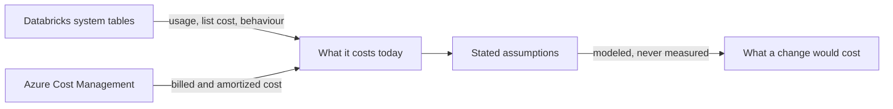

<p align="center">
  
</p>

# DUCAT: Databricks Usage Cost Assessment Tool

A read-only [Claude Code](https://claude.com/claude-code) plugin that works out what a specific
Databricks workload costs today, then designs a way to make it cost less.

You point it at one thing — a job, a pipeline, a SQL warehouse, a team's workload — and it reads
your usage and billing data to establish what that thing actually costs. It then proposes concrete
changes. Each one comes with the evidence behind it, what you save, what the change costs to make,
what you give up, and how to confirm afterwards that the saving landed.

It never optimises an estate at once — every assessment starts from one
confirmed scope. And it never quotes a number it cannot support: where evidence is missing it says
so and narrows what it claims rather than guessing.

The plugin is designed to have read-only functionality. It never writes. No create, update, start,
stop, resize or delete operation is invoked. The output is a Markdown proposal a human reviews and
decides on.

**Claude Code only, for the time being.** The skill itself is Markdown — `skills/ducat/SKILL.md`
and its `references/` — and nothing in it is structurally tied to one harness. Everything around it
is Claude Code's plugin surface: the `.mcp.json` that connects it to Databricks and the
`hooks/hooks.json` that denies the tools it must not use. No other harness has been tried.

## Status

**Implemented.** [`skills/ducat/SKILL.md`](skills/ducat/SKILL.md) and its `references/` are the
package, and they are authoritative. What each file governs:

| Path | What it governs |
|---|---|
| [`skills/ducat/SKILL.md`](skills/ducat/SKILL.md) | Scope gate, workflow, authorization boundary, claim gates, object settings, tool and reference routing |
| [`references/data-sources.md`](skills/ducat/references/data-sources.md) | Evidence semantics, precedence, attribution, pricing joins |
| [`references/freshness.md`](skills/ducat/references/freshness.md) | Dated vendor facts, with a review date |
| [`references/opportunity-catalog.md`](skills/ducat/references/opportunity-catalog.md) | Practice taxonomy, price baseline, scope routing |
| `references/opportunities/` | Optimization practices, one file per scope type |
| [`references/proposal-contract.md`](skills/ducat/references/proposal-contract.md) | Calculation contract, decision card, artifact structure |

All four behavioural witnesses in Section 10 have been run against recorded controls. The clearest
is the scope gate: without the skill the same request produced twenty unrequested queries and a set
of verdicts; with it, no query ran until a scope was confirmed. The witness covering the refusal to
implement has failed and passed on different models, which is why the section below states what is
enforced and what is not.

## What it can claim

A missing source narrows what the skill may claim; it does not stop the assessment. The skill
reports what its evidence supports and labels every figure with the basis behind it.



With Databricks alone, every figure is list cost. Billed cost, negotiated discounts and classic
infrastructure need Azure as well. And every target-state figure is modeled, because nothing
measures a change that has not happened yet.

## Install

The plugin needs a read-only identity and a connection before it can read anything;
[`docs/getting-started.md`](docs/getting-started.md) walks the whole sequence. The plugin's
`.mcp.json` reads two variables, `DATABRICKS_MCP_URL` and `DATABRICKS_SP_TOKEN`, from the shell
Claude Code starts in; [`docs/connect-mcp-server.md`](docs/connect-mcp-server.md) says how to set
them without a secret touching disk.

To install the plugin, add the repository as a marketplace and install from it, at the Claude Code prompt:

```
/plugin marketplace add https://github.com/CauchyIO/ducat.git#plugin
/plugin install ducat@ducat
```

The `#plugin` suffix is not optional. The plugin lives on the `plugin` branch, and the
`CauchyIO/ducat` shorthand resolves to the default branch, which does not carry the manifest.

`/plugin` shows whether it is installed and enabled; `/mcp` shows whether `databricks-sql` is
connected.

## Versions and updates

`plugin.json` declares a `version`, and Claude Code treats that string as the plugin's identity. A
first install takes whatever sits on the `plugin` branch at that moment and labels it with that
version. An existing install picks up changes only once the version is bumped, so pushing to the
branch on its own reaches nobody who already installed. There are no release tags: the `plugin`
branch is the release.

Auto-update is off by default for a marketplace like this one, so updating is something you ask for.
Refresh the marketplace at the Claude Code prompt:

```
/plugin marketplace update ducat
```

then update the plugin from the Installed tab of `/plugin`, or from a shell:

```
claude plugin update ducat@ducat
```

`/reload-plugins` applies the new version to the running session; otherwise the next start does.

## Invoke

At the Claude Code prompt, explicitly as `/ducat:ducat`, or through automatic discovery when a
request matches the skill's description.

## Layout

```text
ducat/
├── .claude-plugin/
│   └── plugin.json                 ← the plugin manifest
├── skills/
│   └── ducat/
│       ├── SKILL.md                ← the skill
│       └── references/             ← what the skill reads at runtime
│           ├── README.md           ← the criteria, and how to change them
│           ├── data-sources.md
│           ├── freshness.md
│           ├── opportunity-catalog.md
│           ├── opportunities/      ← one file per scope type
│           └── proposal-contract.md
├── hooks/
│   ├── hooks.json                  ← runs the hook before the tools it governs
│   └── refuse-writes.py            ← denies the read-write tool and the CLI, see below
├── .mcp.json                       ← the connection to the Databricks SQL MCP server
├── docs/                           ← how it was designed and how to connect it
│   ├── README.md                   ← what each document is for
│   ├── getting-started.md          ← the setup sequence, in order
│   ├── create-read-only-principal.md
│   ├── connect-mcp-server.md
│   ├── smoke-check.md
│   └── map-workspaces-to-azure.md
├── tools/
│   ├── check-package.py            ← refuses credentials and estate identifiers
│   ├── check-consistency.py        ← catches stale dates, prices, and broken routing
│   └── check-upstream.py           ← catches an upstream source that has moved
├── tests/                          ← pytest suite for the scripts and the hook
├── assets/                         ← the Cauchy logo the README shows
├── .pre-commit-config.yaml         ← runs every check before a commit leaves the machine
├── .github/
│   ├── CODE_OF_CONDUCT.md          ← adapted from the Contributor Covenant
│   └── workflows/
│       ├── checks.yml              ← runs every check again on push, as a backstop
│       ├── tests.yml               ← runs the suite on push
│       └── upstream-sources.yml    ← asks weekly whether a source moved
├── pyproject.toml
├── uv.lock
├── Makefile                        ← named targets for install, checks and tests
├── README.md
├── CONTRIBUTING.md
├── SECURITY.md                     ← how to report a vulnerability privately
├── NOTICE.md
└── LICENSE
```

If you are new to the plugin, the recommended readings are the following:
[`docs/README.md`](docs/README.md) names each design and setup document and says when to read it.
[`skills/ducat/references/README.md`](skills/ducat/references/README.md) is a more domain-heavy
document that enumerates the levers that decide what the skill may claim and what counts as a
saving. If you want to understand the evidence and criteria that produce the final suggested outcome
of the skill (or potentially change it), you are encouraged to read this guide.

## Enforcement measures to prevent undesired writes to a workspace

**Enforced by Unity Catalog.** The service principal holds read on system tables and `CAN_USE` on
one warehouse. Every write it attempts is refused by the platform, whatever the model intends.

**Enforced by configuration.** A plugin cannot ship permission rules, so
[`hooks/hooks.json`](hooks/hooks.json) runs [`hooks/refuse-writes.py`](hooks/refuse-writes.py)
before every `databricks-sql` tool and every Bash command. It denies the read-write MCP tool
`execute_sql` and the Databricks CLI outright — the package reads everything through SQL and needs
no CLI — and it approves `execute_sql_read_only` and `poll_sql_result`, so a confirmed scope is not
re-asked per query. This applies only where the plugin is loaded, and no static rule catches an
alias someone invents.

### Other limits

- Azure Databricks only. AWS and GCP are untested.
- Claude Code only. Other agent harnesses are untested.
- Figures are list cost unless Azure Cost Management is reachable. List and billed are reported
  separately and never converted.
- Packaged reference prices carry an as-of date and lose to a live query.
- The default grant is catalog-wide read on `system`, which includes audit logs. The runbook carries
  a narrower per-schema grant for estates where that matters.

## Contributing

One check guards this repository: no credential in any file, and no identifier from one
estate in the package a client reads. [`CONTRIBUTING.md`](CONTRIBUTING.md) says what runs,
how to enable the hook, and what to do when it fails. A security problem goes through the
private channel in [`SECURITY.md`](SECURITY.md), never a public issue.

## Licence

MIT — see [LICENSE](LICENSE).

The references carry distilled enumerations of the FinOps Framework and FOCUS v1.4, both
CC BY 4.0. Their attribution obligations are recorded in [NOTICE.md](NOTICE.md).
