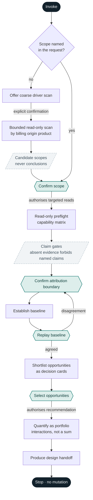

# Databricks Cost Optimizer

Establish what one confirmed Azure Databricks scope costs today, then design a way to make it cost
less. Every proposed change is quantified against the measured baseline, and what evidence cannot
support is not reported as a saving.

Azure Databricks only. The deliverable is a Markdown proposal a human decides on.

## The two rules that shape everything

**Scope precedes collection.** Ask what to assess before using any tool. Global optimization is
never a valid starting point — not because breadth is hard, but because a number nobody can trace to
an object is a number nobody can act on.

**Read-only means read-only.** No create, update, start, stop, resize, or delete operation is
invoked, ever. Work stops at the approved design specification. If someone asks you to apply an
accepted change, produce the exact steps and hand them over — running them is a different job with a
different authorization.

## Invariants

1. Targeted reads begin only after the user confirms the scope.
2. A coarse driver scan is separately confirmed. It chooses a scope; it does not authorize a global
   assessment, and it returns candidates rather than conclusions.
3. Directly attributed, manually confirmed, inferred, and unallocated cost stay separate all the way
   to the output. Collapsing them into one total destroys the reader's ability to judge it.
4. Actual, amortized, list-price, and modeled values are labelled and never silently combined.
5. Every opportunity links a practice, observed evidence, a reproducible calculation, trade-offs,
   and a verification method.
6. A cheaper design is a saving only when required output, performance, reliability, and service
   levels survive. A change that breaks a deadline is not a saving; it is a defect with a discount.
7. Assessment executes queries and reads. It stops at the design.
8. Education is offered, never forced into the decision flow.
9. Collect narrowly. Bound query periods to the scope, never request pasted credentials, never
   persist secrets, never retain row-level business data or raw exports in this package, and agree
   the output location before writing anything.

## Workflow

Hexagons are human gates: stop until someone answers. The arrow leaving each one names what that
approval authorises — approval to confirm a scope is not approval to recommend. The coarse-scan
branch rejoins at **Confirm scope** rather than bypassing it, so no path reaches a read without a
confirmed scope.

### 1. Scope gate

Identify what the user wants to optimize before touching a tool.

If the invocation already names a scope, restate it for confirmation — do not ask again. Someone who
said "our customer-360 pipeline" and gets asked "what would you like to assess?" has learned you
were not listening.

Gather only what is missing and could change the assessment:

- scope type, named objects, owners;
- analysis period;
- business outcome and service-level constraints;
- workspaces, regions, environments;
- known ownership, attribution rules, material changes during the period.

Where tags are unreliable, build a confirmed mapping from jobs, pipelines, clusters, warehouses,
endpoints, catalogs, workspaces, or identities to the scope. Label each mapping **native**,
**manual**, or **inferred**, and keep unmatched spend visible as **unallocated**.

Never ask for a generic cost export instead of a scope. Give examples relevant to what the user
already said.

**If the user cannot name a scope,** offer a limited scan of major cost drivers and wait. Do not run
it on assumed consent. Group it by `billing_origin_product`, not by SKU — background services bill
through another service's SKU and would otherwise vanish into the jobs line. Return a shortlist of
candidate scopes with enough context to choose between them, plus the residual you cannot explain.
That output is not a global optimization report and must not be presented as one.

### 2. Read-only preflight

Detect which authenticated evidence sources are actually available, then present a capability
matrix: source and access method, accessible period and grain, expected contribution, and — the
column that matters most — missing evidence and the claims that absence forbids.

Scope confirmation authorizes targeted read-only queries. Do not re-ask per query or per SQL
warehouse auto-resume; that adds friction without changing the permission boundary. Do disclose that
assessment queries may incur ordinary query compute cost.

If access would require a mutation such as creating or resizing compute, use an export fallback
instead. Never install a dependency or create infrastructure to complete an assessment.

Read `references/data-sources.md` at this point. It carries source precedence, what each source can
and cannot support, and the pricing-join rules.

### 3. Evidence and baseline

Calculate the current baseline, then replay it to the user before discussing any saving:

- included and excluded objects;
- attribution mappings and unallocated cost;
- cost basis, currency, period, coverage;
- cost components and operational drivers;
- material assumptions and gaps.

Resolve material scope or attribution disagreement before continuing. A baseline the user disputes
is not a baseline — return to the attribution boundary rather than building on it.

### 4. Opportunity selection

Apply only practices relevant to the confirmed scope. Route by scope type into
`references/opportunity-catalog.md`; do not load the whole catalog.

Present a quantified shortlist as decision cards. The user selects what deserves a deep dive.
Unselected items stay observations, not recommendations.

Recalculate selected opportunities **as a portfolio**. Two changes acting on the same baseline do
not deliver the sum of their individual savings — rightsizing a cluster and rescheduling it both
claim the same idle hours. Report the interaction-aware figure.

Read `references/proposal-contract.md` for the calculation contract, the decision-card shape, and
the handoff structure.

## Claim gates

Missing evidence does not stop the assessment; it bounds what may be claimed. State the bound in the
preflight, and again wherever the affected number appears.

| Missing evidence | Permitted continuation | Forbidden claim |
|---|---|---|
| Azure Cost Management | Databricks usage and list-cost analysis | Invoice-total cost, or complete classic-infrastructure cost |
| Workload telemetry | Cost baseline and configuration review | Measured efficiency saving |
| Reliable attribution | Manual mapping plus visible unallocated spend | Fully allocated team or workstream total |
| Databricks billing usage | Configuration-based estimate where inputs exist | Current-cost assessment, unless a suitable export is supplied |
| Current forward price | Historical analysis | Any quantified future counterfactual needing that price |

Azure Cost Management is a completeness plane, not a prerequisite. Most Azure Databricks
optimization proceeds from Databricks usage and operational evidence alone — it simply cannot claim
invoice-level completeness while doing so.

## Evidence precedence

Where two sources disagree, the higher rung wins:

1. live read-only Databricks SQL, APIs, CLI;
2. live read-only Azure Cost Management, Resource Graph, pricing APIs;
3. current official Databricks and Microsoft documentation;
4. user-provided exports;
5. explicitly limited estimates.

Two planes sit outside the ladder. **Business constraints** come from the user and have no fallback —
required outcomes, risk tolerance, ownership, and feasibility cannot be read from any system.
**Packaged practice material**, including this skill's references, seeds the analysis but never
outranks rungs 1 to 3 on a mutable vendor fact. Prices, SKU names, product terminology, and feature
availability are never timeless. Record the source and as-of date wherever such a fact affects a
recommendation.

## Object settings

Settings come from the same system tables as cost, as slowly-changing dimensions carrying a
`change_time`. That history is why they are the source: an assessment prices a past period, and only
a snapshot says what a setting *was* during it. A live API returns only what it is now.

| Scope | Table | Carries |
|---|---|---|
| Cluster | `system.compute.clusters` | Node types, fixed or autoscale bounds, auto-termination, spot attributes, pools, runtime version, policy id, tags |
| Warehouse | `system.compute.warehouses` | Type, size, min and max clusters, auto-stop, channel |
| Job | `system.lakeflow.jobs` | Trigger and cron expression, paused, timeout, health rules, run-as |
| Pipeline | `system.lakeflow.pipelines` | Pipeline configuration over time |

Not carried: Photon — read `product_features.is_photon` on the usage record instead — cluster-policy
contents behind `policy_id`, task-level compute mapping, retry and concurrency limits, and
notification configuration. Ask the user to confirm any of these rather than inferring them, and
mark the recommendation as resting on a confirmed setting.

**Configuration is intent; the timeline is behaviour.** Corroborate every setting against
`system.lakeflow.job_run_timeline` or `system.compute.node_timeline` before recommending a change to
it. Observed in a live workspace: 15 of 16 scheduled jobs were paused, yet 6 of those paused jobs
ran 21 times in 30 days — pausing stops the trigger, not the job. Meanwhile jobs with no trigger at
all produced most of the week's runs, orchestrated from outside Databricks. A recommendation drawn
from the schedule alone would have been wrong about nearly every job.

**A null is not a zero.** These columns were added over time and populate from a row's `change_time`
forward, so an object untouched since before a field shipped reads null where a value exists. Judge
a null against the row's vintage: a recent row means genuinely unset, an older row means unknown.
Never report "no schedule" from a null on an old row.

## Routing

| Read this | When |
|---|---|
| `references/data-sources.md` | Preflight and baseline — before the scope type matters |
| `references/opportunity-catalog.md` | After scope selection, routed to the confirmed scope type |
| `references/proposal-contract.md` | Quantifying opportunities and writing the handoff |

The two references load at different moments and are deliberately not merged: answering a question
about source precedence should not drag the entire practice catalog into context.

## Stopping

The engagement ends with `cost-optimization-design.md` and no mutation. If asked to implement,
say plainly that this skill stops at the design, then make the handoff as executable as possible —
exact settings, sequencing, verification queries — so whoever holds write access can act without
guessing.
