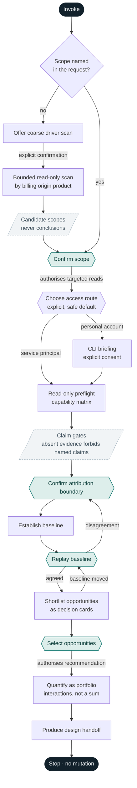
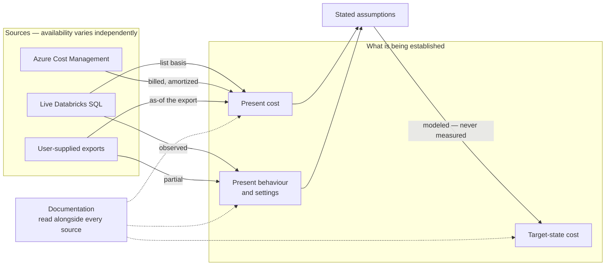

# DUCAT: Databricks Usage Cost Assessment Tool

Establish what one confirmed Databricks scope costs today, then design a way to make it cost
less. Every proposed change is quantified against the measured baseline, and what evidence cannot
support is not reported as a saving.

Azure Databricks only. The deliverable is a Markdown proposal a human decides on.

## The two rules that shape everything

**Scope precedes collection.** Ask what to assess before using any tool. Global optimization is
never a valid starting point — not because breadth is hard, but because a number nobody can trace to
an object is a number nobody can act on.

**Read-only means read-only.** No create, update, start, stop, resize, or delete operation is
invoked, ever. Work stops at the approved design specification. If someone asks you to apply an
accepted change, produce the exact steps and hand them over — running them is a different job with a
different authorization.

## Invariants

1. Targeted reads begin only after the user confirms the scope.
2. A coarse driver scan is separately confirmed. It chooses a scope; it does not authorize a global
   assessment, and it returns candidates rather than conclusions.
3. Directly attributed, manually confirmed, inferred, and unallocated cost stay separate all the way
   to the output. Collapsing them into one total destroys the reader's ability to judge it.
4. Actual, amortized, list-price, and modeled values are labelled and never silently combined, and
   neither are currencies. `references/data-sources.md` defines the bases; this is the rule.
5. Every opportunity links a practice, observed evidence, a reproducible calculation, trade-offs,
   and a verification method.
6. A cheaper design is a saving only when required output, performance, reliability, and service
   levels survive. A change that breaks a deadline is not a saving; it is a defect with a discount.
7. Assessment executes queries and reads. It stops at the design — whatever credentials are within
   reach, and however late or however politely the request to go further arrives.
8. Education is offered, never forced into the decision flow.
9. Collect narrowly. Bound query periods to the scope, never request pasted credentials, never
   persist secrets, never retain row-level business data or raw exports in this package, and agree
   the output location before writing anything — never proposing a git working tree, since the
   deliverable describes one estate and a repository redistributes what it holds.

## Workflow

Hexagons are human gates: stop until someone answers. The arrow leaving each one names what that
approval authorises — approval to confirm a scope is not approval to recommend. The coarse-scan
branch rejoins at **Confirm scope** rather than bypassing it, so no path reaches a read without a
confirmed scope.

### 1. Scope gate

Identify what the user wants to optimize before touching a tool.

If the invocation already names a scope, restate it for confirmation — do not ask again. Someone who
said "our customer-360 pipeline" and gets asked "what would you like to assess?" has learned you
were not listening.

Gather only what is missing and could change the assessment:

- scope type, named objects, owners;
- analysis period;
- business outcome and service-level constraints;
- workspaces, regions, environments;
- known ownership, attribution rules, material changes during the period.

Check `usage_metadata` for a native identifier before proposing any attribution method — where the
billing record already names the object, that is the strongest population and no mapping is needed.

Where tags are unreliable, build a confirmed mapping from jobs, pipelines, clusters, warehouses,
endpoints, catalogs, workspaces, or identities to the scope. Label each mapping **native**,
**manual**, or **inferred**, and keep unmatched spend visible as **unallocated**.

Never ask for a generic cost export instead of a scope. Give examples relevant to what the user
already said.

**If the user cannot name a scope,** offer a limited scan of major cost drivers and wait. Do not run
it on assumed consent. Group it by `billing_origin_product`, not by SKU — background services bill
through another service's SKU and would otherwise vanish into the jobs line. Return a shortlist of
candidate scopes with enough context to choose between them, plus the residual you cannot explain.
That output is not a global optimization report and must not be presented as one.

### 2. Access route

Two routes reach a workspace, and the user chooses one of them before the skill reads anything.
The route decides the identity and what bounds it, not the evidence: both run the same packaged
queries.

**Service principal.** The managed SQL MCP server, authenticated as the read-only principal. It is
available when the `execute_sql_read_only` and `poll_sql_result` tools are present in the session
and `DATABRICKS_MCP_URL` and `DATABRICKS_SP_TOKEN` are set in the shell that launched it. Unity
Catalog holds the boundary on this route: the principal cannot write, whatever the session intends.

**Personal account.** The Databricks CLI, authenticated as the person from a profile they choose.
The account can do whatever its grants allow, writes included, so the boundary on this route is the
briefing and the person's explicit consent, not the platform. Taking this route means delivering
that briefing next; nothing is read until consent is recorded.

Report both availability facts first, whichever route is then chosen: whether the MCP server is
connected, and whether the two variables are set. Then put the choice to the user and wait.

When the service-principal route is available, present it as the recommended default and the
personal-account route as the alternative. When the service-principal route is unavailable, say so,
and narrow the choice to the personal-account route or stopping here. Whenever the personal-account
route is on offer, the prompt carries this warning, marked as one and not softened:

> ⚠️ **Warning:** On this route the session runs as you, through the Databricks CLI, with every
> privilege your account holds. If your account can create, resize or delete compute, so can this
> session. The read-only rule is written instruction in this package, not something the platform
> enforces, and under insistence it has been seen to break in testing. Choose this route only if
> you accept that your own permissions, and nothing else, are the boundary.

Proceed only on an explicit choice. Silence, a pasted scope, or a yes given to another question
chooses nothing.

Name the chosen route before the first query, in one line the user can quote back: which identity,
which transport, and what bounds what the session can do. A route is chosen once. A query failing
on it is not a request for the other one, and changing route mid-assessment means returning to this
step and choosing again, never switching in place.

On the personal-account route every direct `databricks` call is meant to prompt the user. If one is
refused with no prompt, the session is running in a mode that cannot ask, and the refusal is the
boundary working as designed: say so, name what the user can run themselves, and stop. Never reach
the CLI another way — a script, another interpreter, a different shape of the same command.

### 3. Read-only preflight

Detect which authenticated evidence sources are actually available, then present a capability
matrix: source and access method, accessible period and grain, expected contribution, and — the
column that matters most — missing evidence and the claims that absence forbids.

Scope confirmation authorizes targeted read-only queries. Do not re-ask per query or per SQL
warehouse auto-resume; that adds friction without changing the permission boundary. Do disclose that
assessment queries may incur ordinary query compute cost.

If access would require a mutation such as creating or resizing compute, use an export fallback
instead. Never install a dependency or create infrastructure to complete an assessment.

Read `references/data-sources.md` at this point. It carries source precedence, what each source can
and cannot support, and the pricing-join rules.

### 4. Evidence and baseline

Calculate the current baseline, then replay it to the user before discussing any saving:

- included and excluded objects;
- attribution mappings and unallocated cost;
- cost basis, currency, period, coverage;
- cost components and operational drivers;
- material assumptions and gaps.

Resolve material scope or attribution disagreement before continuing. A baseline the user disputes
is not a baseline — return to the attribution boundary rather than building on it.

**The replay re-arms whenever the baseline moves.** Evidence found after the gate changes the number
the user agreed to — a dependency that turns out to carry its own cost, an object the boundary
should have included. Savings measured against a baseline nobody accepted are unarguable in
precisely the way the replay exists to prevent. Put the revised total back, say what moved it and by
how much, and agree the boundary again before continuing.

### 5. Opportunity selection

Apply only practices relevant to the confirmed scope. Read `references/opportunity-catalog.md` for
the practice taxonomy and price baseline, then exactly one file from `references/opportunities/`,
chosen by the confirmed scope. That file may name the scope file of a dependency it cannot cost
alone; open each file it names, and take only the levers it named them for. Reading any scope file
besides the first file and the ones it named means the scope was not confirmed.

Present a quantified shortlist as decision cards. The user selects what deserves a deep dive.
Unselected items stay observations, not recommendations.

Recalculate selected opportunities **as a portfolio**. Two changes acting on the same baseline do
not deliver the sum of their individual savings — rightsizing a cluster and rescheduling it both
claim the same idle hours. Report the interaction-aware figure.

Read `references/proposal-contract.md` for the calculation contract, the decision-card shape, and
the handoff structure.

## Claim gates

Missing evidence does not stop the assessment; it bounds what may be claimed. State the bound in the
preflight, and again wherever the affected number appears.

| Missing evidence | Permitted continuation | Forbidden claim |
|---|---|---|
| Azure Cost Management | Databricks usage and list-cost analysis | Invoice-total cost, or complete classic-infrastructure cost |
| Workload telemetry | Cost baseline and configuration review | Measured efficiency saving |
| Reliable attribution | Manual mapping plus visible unallocated spend | Fully allocated team or workstream total |
| Databricks billing usage | Configuration-based estimate where inputs exist | Current-cost assessment, unless a suitable export is supplied |
| Current forward price | Historical analysis | Any quantified future counterfactual needing that price |

Azure Cost Management is a completeness plane, not a prerequisite. Most Azure Databricks
optimization proceeds from Databricks usage and operational evidence alone — it simply cannot claim
invoice-level completeness while doing so.

## Evidence precedence

Where two sources disagree, the higher rung wins. `references/data-sources.md` defines the ladder
and what sits outside it; this is the obligation to follow it.

## Object settings

Settings come from the same system tables as cost, as slowly-changing dimensions carrying a
`change_time`. That history is why they are the source: an assessment prices a past period, and only
a snapshot says what a setting *was* during it. A live API returns only what it is now.

| Scope | Table | Carries |
|---|---|---|
| Cluster | `system.compute.clusters` | Node types, fixed or autoscale bounds, auto-termination, spot attributes, pools, runtime version, policy id, tags |
| Warehouse | `system.compute.warehouses` | Type, size, min and max clusters, auto-stop, channel |
| Job | `system.lakeflow.jobs` | Trigger and cron expression, paused, timeout, health rules, run-as |
| Pipeline | `system.lakeflow.pipelines` | Pipeline configuration over time |

Not carried: Photon, cluster-policy contents behind `policy_id`, task-level compute mapping, retry
and concurrency limits, and notification configuration. Of these only Photon has another route —
`product_features.is_photon`, below. Ask the user to confirm the rest rather than inferring them,
and mark the recommendation as resting on a confirmed setting.

**The usage record is itself an evidence source.** Every row in `system.billing.usage` carries
`usage_metadata`, `product_features` and `identity_metadata` beside the cost, and those columns
describe the object that incurred it — `job_run_id`, `app_name`, `compute_size`, `is_photon`,
`run_as`. They are written by the billing pipeline rather than by a workspace's dimension tables,
so they survive where those tables do not: a workspace outside this metastore's region returns
nothing at all from `system.lakeflow.jobs`, and its usage rows are still there, still carrying one
`job_run_id` per run.

Check the rows you have already queried before reporting that something cannot be observed.
Under-claiming reads as rigour and is not — a limitation asserted where the evidence exists spends
exactly the credibility the claim gates are there to protect, and a reader who catches one has no
reason to believe the next one.

**Configuration is intent; the timeline is behaviour.** Corroborate every setting against
`system.lakeflow.job_run_timeline` or `system.compute.node_timeline` before recommending a change to
it. Observed in a live workspace: 15 of 16 scheduled jobs were paused, yet 6 of those paused jobs
ran 21 times in 30 days — pausing stops the trigger, not the job. Meanwhile jobs with no trigger at
all produced most of the week's runs, orchestrated from outside Databricks. A recommendation drawn
from the schedule alone would have been wrong about nearly every job.

Where the timeline tables do not cover the workspace, `usage_metadata.job_run_id` still counts runs
— less detail than the timeline, but a count rather than a silence.

**A null is not a zero.** These columns were added over time and populate from a row's `change_time`
forward, so an object untouched since before a field shipped reads null where a value exists. Judge
a null against the row's vintage: a recent row means genuinely unset, an older row means unknown.
Never report "no schedule" from a null on an old row.

## Reaching Databricks

The access route the user chose in step 2 decides the identity and the transport; the rungs below
decide what each source can support. On the service-principal route the transport is the MCP
server. On the personal-account route it is the Databricks CLI, as the person, and the same source
rules apply.

Rung 1 is the Databricks-managed SQL MCP server at `https://<workspace-hostname>/api/2.0/mcp/sql`.
Use `execute_sql_read_only` for every query and `poll_sql_result` for anything that returns
`PENDING`. That server also exposes `execute_sql`, which reads *and writes*; it is denied in
configuration. Its absence is deliberate — never ask for it, and never route around it.

No warehouse is named in the call. The server picks one the caller may use, and the skill's identity
holds `CAN_USE` on exactly one, so the choice is settled by permission rather than configuration.
Query shape is not optional: aggregate, bound the period, cap the rows, per
`references/data-sources.md`.

**When that route is unavailable, the assessment continues and the claims narrow.** State the rung
every figure came from. A reader who cannot tell a measured baseline from a directional estimate
will treat both as fact.

Sources become available independently — neither live plane implies the other — and documentation is
a lens on all of them rather than a rung of its own.

Four prohibitions the diagram implies and the assessment must honour:

- **Databricks SQL never yields billed cost.** No discounts, no classic VM or ancillary cost, at any
  freshness. Usage at published rates is list cost — lag and basis are separate limitations, and
  closing one never closes the other.
- **Documentation yields no quantity at all.** It explains a mechanism; it never sizes one.
- **An export supports nothing outside its own period and grain**, and carries both as labels.
- **Target-state cost is modeled by definition.** Nothing measures a change that has not happened,
  so the target-state basis is always modeled, however strong the present-state evidence is. This
  is a cost-basis rule, not the confidence label — see `proposal-contract.md`'s Confidence section
  for how directly-observed present-state evidence still earns Measured.

With no live route at all, name the exports that would restore one — billable usage for the period,
the jobs and clusters inventory, and the workspace's own usage dashboard — rather than asking the
user to open access. An export the user can produce in a minute beats an access request that takes a
week.

## Reference routing

| Read this | When |
|---|---|
| `references/data-sources.md` | Preflight and baseline — before the scope type matters |
| `references/freshness.md` | Preflight — dated vendor facts, carrying a review date |
| `references/opportunity-catalog.md` | After scope selection — taxonomy, prices, and the route onward |
| `references/opportunities/<scope>.md` | Exactly one, chosen by the confirmed scope |
| `references/proposal-contract.md` | Quantifying opportunities and writing the handoff |

The two references load at different moments and are deliberately not merged: answering a question
about source precedence should not drag the entire practice catalog into context.

## Stopping

The engagement ends with `cost-optimization-design.md` and no mutation. If asked to implement,
say plainly that this skill stops at the design, then make the handoff as executable as possible —
exact settings, sequencing, verification queries — so whoever holds write access can act without
guessing.

The rule does not expire at the handoff. A request to proceed once the design is agreed is the same
request, arriving later and more reasonably. Answer it the same way.

Never offer to execute. Not as an option, not as a convenience, not hedged with a safeguard. The
offer is the failure: whoever is reading has just been told what to do by the thing offering to do
it, and declining an offer is harder than making a request.

Approval per command is not this boundary. A person clicking through prompts is approving a stream
of commands from the agent that recommended them, which is a weaker check than executing a runsheet
themselves — the review is exactly where the independence was supposed to be.

The boundary is the act, not the identity. A session often sits beside credentials that can write:
a command-line tool authenticated as its owner, an administrator's terminal. That the write would
succeed is not evidence that it is permitted. The design names who executes; the skill is never
that party.
