# Assess and optimize your Databricks setup with this Claude skill 
*Databricks Usage and Costs Assessment Tool (DUCAT) reviews your current platform and suggests improvements to make it cost less*

Brace yourselves: it is that day of the month again. Your cloud bill has just arrived and, with it, a myriad of questions no one is able to properly answer: 

* Why is our bill higher this month? 
* What team or project is driving up the costs? 
* How can we possibly cut the bill while delivering on our service level agreements? 
* Who of you decided it was a good idea to leave a virtual machine (VM) active over the weekend and generate the cloud cost equivalent to leaving the lights on in your house while you go abroad on a month vacation? No judgment (okay, maybe some judgment). 

Most likely, you have had to ask or answer at least one of these questions. The good news is you are not alone! According to a survey conducted in 2025 with about 2,300 participants across the entire globe, [94% of IT leaders are struggling to understand and optimize cloud costs](https://news.cision.com/softwareone/r/94--of-it-leaders-struggle-to-optimize-cloud-costs,c4231173). 

Like many others, we at Cauchy have felt these challenges first-hand, and we have [written before](https://blog.cauchy.io/p/the-complete-guide-to-databricks) about how we practice FinOps, the discipline of managing cloud spend jointly between engineering and finance. On Databricks in particular, a handful of [system tables](https://docs.databricks.com/aws/en/admin/system-tables/) hold most of the answers. They let you identify the major cost drivers and review the platform critically, looking for optimizations such as tightening an auto-termination schedule or choosing a cheaper VM for your extract, transform, and load (ETL) jobs. 

## Where LLMs come in 
As individual data practitioners at Cauchy, we know what sources to explore and what considerations to bear in mind in order to diagnose Databricks overspending and come up with cheaper alternatives. However, this is not as simple as it seems, even for experienced Databricks users and especially for teams that do not have Databricks specialists on hand. Thus, we set out to create a skill that is able to distill Databricks cost optimization knowledge into a generalizable approach that can be used by both experienced engineers and newcomers to the platform alike. 

One of the primary goals when creating the skill was that it adhere to the following standards when given a request to optimize a Databricks scope: 

* Consistently follow the same user workflow procedure. 
* Review and optimize Databricks scope settings consistently against predefined criteria. 
* Consistently provide a standardized, structured report covering every relevant aspect of the workflow. 

The three standards should hold across different user runs, turning the skill workflow into a semi-deterministic cost assessment where the user is prompted to define the constraints of the optimization problem, and the task of reading system tables and extracting conclusions from them is delegated to your choice of Claude model. 

In this blog post, I will write about the approach we used to define the skill, followed by the workflow it runs to first review, then optimize, a Databricks setup. I will also cover some of its limitations: some we have tackled, others remain open. 

So let's get on with it!

## How it works 

### Two governing rules 
* Scope confirmations precedes analysis: Global optimization is never a valid starting point. Prior to the assessment, the user must provide key information about the optimization scope in terms of resources, attribution method, period of analysis, etc. Only after this is done can the optimization be meaningful.
* Read-only workflow: no create, update, start, stop, resize, or delete operations are ever invoked. 

### The workflow at a glance 

DUCAT never runs end to end on its own. It stops four times to ask you something, and it cannot continue until you answer. We call those stops gates, and the diagram below shows only them. Everything between two gates is DUCAT reading system tables and coming back with a result for you to judge.

```mermaid
flowchart LR
  START(["'Can you optimize my Databricks project?'"]) --> G1{{"Gate 1: You choose the authentication and access route"}}
  G1 --> G2{{"Gate 2: You choose and confirm the scope"}}
  G2 --> G3{{"Gate 3: You confirm the baseline matches what you know"}}
  G3 -->|"no, something is off"| G2
  G3 -->|"yes"| G4{{"Gate 4: You choose which cost-saving cards go forward"}}
  G4 --> STOP(["DUCAT hands off the design.<br/>Nothing in your workspace has changed"])

  classDef gate fill:#DDEEEB,stroke:#0F766E,stroke-width:1.5px,color:#0B3D39;
  classDef term fill:#12212B,stroke:#12212B,color:#F1F4F6;
  class G1,G2,G3,G4 gate;
  class START,STOP term;
```

### The user gates
#### 1. Choosing an authentication and access route 
Before DUCAT reads a single row, you choose how it reaches your workspace. We have defined two separate routes, each of which uses a different authentication token and access gate:

- **Read-only service principal + Databricks MCP Server** (recommended default setting): a [step-by-step](../docs/getting-started.md) tutorial is provided on how to provision a read-only service principal, and how to mint a token linked to that identity that is used to reach the Databricks MCP server. Since the service principal created is read-only, this approach ensures that the workspace will not be modified by the skill (a constraint enforced numerous times in Markdown text that we have observed can be violated if the user pressures Claude hard enough).

- **Databricks personal account + Databricks CLI**: in order to follow this route, all that is needed from you is to have logged in to your Databrick workspace with your personal account via the CLI. It is important to bear in mind that, if you choose to use the skill with this route, you might allow Claude to modify the provisions of your workspace or make writes to your database. However, even if you choose this method, to provide an extra layer of security, we have designed the skill so that Databricks bash commands are only ever executed after explicit authorization from the user. This is set in [.claude/settings.json](../.claude/settings.json), where Bash(databricks:*) has the ask permission.

Note that we have created these two predefined access and authenticaiton routes, but you can tinker with the setup and create your own. For example, you might want to interact with your workspace via the MCP server using your personal account. However, this will require you to go actively change the provided workflow or expand it so that it is able to account for your custom route.

#### 2. Choosing a scope 
This is where "optimize my Databricks" gets turned into a question DUCAT can actually answer. 

If your request already names a [scope](../references/opportunity-catalog.md), DUCAT restates it and asks you to confirm. If something is missing that could change the assessment, DUCAT asks for it. For example:

- What kind of thing are we looking at? A job, a pipeline, a SQL warehouse, a serving endpoint, or a whole team's spend?
- What are those objects called in the workspace?
- What kind of results does this project deliver, and on what frequency?

Answering these questions helps narrow down the scope of optimization. If you cannot determine the scope (what elements of the project/workspace you want to optimize), DUCAT offers a bounded, coarse scan of your major cost drivers. After user consent is granted, the scan returns candidate scopes and, once you pick one, you arrive back at this gate. A confirmed scope is a hard requirement for a targeted read.

Based on the information provided by the user and the remaining available evidence, our skill discriminates between the following types of attribution, ordered in decreasing order in terms of degree of confidence:

* **Native.** The billing record itself names the object, through a job ID, a warehouse ID, a pipeline ID, or similar. The platform did the work, and DUCAT looks for this first. 
* **Manual.** A person asserted that the object belongs to the scope, either by confirming it in the conversation or by tagging it in the workspace. 
* **Inferred.** The object was matched by name or convention, with nothing on the record to confirm it. 
* **Unallocated.** Spend in the period that matched nothing. It gets its own line and is never spread across the others. 

The four stay separate all the way to the final report because collapsing them into one total destroys your ability to judge it. A figure that is 80% native and 20% inferred is a different figure from one that is 20% native and 80% inferred, even when they add up to the same amount. 

Figures are always reported along with their attribution type, rather than simply provided. A job that runs on shared all-purpose compute leaves no job ID on the billing record, so per-job attribution is structurally impossible there. A cluster launched from a pool inherits the pool's tags, so the cluster's own tags never reach the cloud bill. A warehouse serving several teams has to be split in proportion to each team's query time, and the queries that carried no team tag are unallocated spend, not free spend. 

#### 3. Confirming a baseline 
After the scope has been confirmed, a series of targeted reads are done against the system tables of your Databricks workspace. The next step in the workflow is consolidating the information coming from the output of those queries and replaying it to the user. Two possible scenarios follow:

- Scenario 1: user acknowledges the baseline suggested by the skill and gives a clear *go ahead*, thus proceeding to the next step.
- Scenario 2: user disputes one or more aspects of the suggested baseline. What follows then is a new, refined baseline that incorporates the feedback of the user, bringing them to the beginning of this step again.

#### 4. Selecting one or several cost optimization paths 
Only now that the baseline has been confirmed by the user does the skill look for potential cost saving recommendations. In order to create such recommendations, the skill makes use of two manually curated sets of references:

- Data sources: a list of all the available sources of evidence the skill might use for the recommendation, specifying order of preference, help on interpreting query results, rules on making conclusions, among others. It serves as sort of an alongside manual for the skill to follow along with querying the Databricks workspace, or having to resort to any of the alternative sources.

- Opportunity catalog: a number of files pinpointing different ways in which specific scopes can be made cheaper. Think of it as the tools in your belt as a cloud cost saving specialist. For example, the following actions can be potentially performed in order to optimize a Databricks job: for example, right-sizing the job cluster, or modifying the autotermination settings. 

What comes out as a result of this process is a number of cost saving opportunities, presented as cards, with the following attributes:

- Description of the cost saving idea: what idea does the opportunity card contain.
- Description of intial claim: what cost claim does the skill make, along with evidence used for that claim.
- Description of suggested modification: what new setting the skill suggests and what savings would the user incur were they to implement it.

You choose which cards go forward into the final report and which ones are discarded.

#### 5. Generating report 
The engagement ends with one Markdown document, `cost-optimization-design.md`, with the following sections:

1. Decision summary 
2. Scope and evidence 
3. Current-state baseline 
4. Opportunity disposition 
5. Target-state design 
6. Financial case 
7. Implementation and verification 
8. Open decisions and limitations 

## An example run 
Here we illustrate the skill workflow with Steven’s cold run for RDW project. 

#### The safeguards 
Here we speak about staleness tests for references. 

#### Limitations and aspects to consider 
- Read-only enforcements in the skill instructions are bypassed when user pushes hard enough.
- Lack of implementation of eval suite: testing of the skill has been mostly manual and we lack a scoreboard that rates the output of the skill,
#### Conclusions 

## Appendix 

### Full workflow diagram 

