# Assess and optimise your Databricks setup with this Claude skill 
*DUCAT reviews your current platform and suggests improvements to make it cost less*

Brace yourselves: it is that day of the month again. Your cloud bill has just arrived and with it, a myriad of questions no one is able to properly answer: 

* Why is our bill higher this month? 
* What team or project is driving up the costs? 
* How can we possibly cut the bill while delivering on our SLAs? 
* Who of you decided it was a good idea to leave a VM active over the weekend and generate the cloud cost equivalent to leaving the lights on in your house while you go abroad on a month vacation? No judgment (okay, maybe some judgement) 

Most likely you have had to ask or answer at least one of these questions. The good news is: you are not alone! According to a report from 2025, [up to 94% of IT leaders are struggling to understand and optimize these costs](https://news.cision.com/softwareone/r/94--of-it-leaders-struggle-to-optimize-cloud-costs,c4231173). 

As many others, [we are aware](https://blog.cauchy.io/p/the-complete-guide-to-databricks) of the current challenges with regards to FinOps in Cauchy. Particularly on Databricks setups, a number of system tables can be used to find relevant conclusions tackling those challenges: identifying major cost drivers and reviewing the platform critically, in the hopes of spotting potential cost optimizations: modifying an auto-shutdown schedule, or choosing a cheaper VM for your ETL jobs, for example. 

## Where LLMs come in 
We, at Cauchy, as individual data practitioners, know what sources to use, and what considerations to bear in mind, in order to diagnose an overpriced Databricks scope and come up with a cheaper alternative. The challenge we set ourselves building this skill was: can we distil this knowledge into a generalizable approach, which, given a request to optimise a Databricks scope... 

* Follows consistently the same user workflow procedure 
* Review and optimizes Databricks scope settings consistently, using a predefined criterion 
* Provides consistently a standardized structured output report, tackling every relevant aspect present in the workflow 

The three goals above should hold across different user runs, turning the skill workflow into a semi-deterministic cost assessment where the user is prompted to define the constraints of the optimization problem, and the task of reading system tables and extracting conclusions from them is delegated on your choice of Claude model. 

In this blog post, I will speak about the speak about the approach followed by the skill workflow to first review, then optimize a Databricks setup. I will also mention some limitations of the skill: some we have tackled; others remain open at the moment. 

Let’s get on with it. 

## The workflow 

### Two governing rules for the workflow 
* Scope confirmation precede analysis: Global optimization is never a valid starting point. Prior to the assessment, user must provide key information about the optimization scope in terms of resources, attribution method, period of analysis, etc. Only then the optimization can be meaningful. 
* Read-only workflow: no create, update, start, stop, resize or delete operation is invoked, ever. 

### Diagram 

```mermaid
flowchart TD
  START(["'Can you optimize my Databricks project?'"]) --> ROUTE{{"Gate 1: Choosing authentication route"}}
  ROUTE -->|"service principal: the platform enforces read-only"| Q{"Did you name<br/>the scope<br/>in the original request?"}
  ROUTE -->|"your own account: only your consent bounds it"| BRIEF["DUCAT briefs you on the risk<br/>and waits for a clear yes"]
  BRIEF --> Q

  Q -->|"no"| OFFER["DUCAT offers a quick scan<br/>of what is driving spend"]
  OFFER -->|"you say go"| SCAN["A bounded, read-only look<br/>at spend by product"]
  SCAN --> CAND[/"Show a list of candidate scopes.<br/>Not findings yet"/]
  CAND --> GATE

  Q -->|"yes"| GATE{{"Gate 2: You choose and confirm the scope.<br/>Nothing specific is read before this"}}
  GATE -->|"you unlock targeted reads"| PRE["DUCAT checks which evidence<br/>sources it can actually reach"]
  PRE --> CLAIM[/"Constraint: What cannot be reached cannot be claimed"/]
  CLAIM --> ATTR{{"Gate 3: You agree what counts as this scope's cost<br/>and what is left out"}}
  ATTR --> BASE["DUCAT measures what the scope<br/>costs today, from billing data"]
  BASE --> REPLAY{{"Gate 4: DUCAT plays the baseline back to you.<br/>Does it match what you know?"}}
  REPLAY -->|"no, something is off"| ATTR
  REPLAY -->|"yes"| SHORT["DUCAT lists ways to spend less.<br/>Each is a decision card with evidence and trade-offs"]
  SHORT -->|"the numbers moved"| REPLAY
  SHORT --> SEL{{"Gate 5: You choose which cards go forward"}}
  SEL -->|"you unlock a recommendation"| PORT["DUCAT prices the chosen changes together,<br/>allowing for how they interact"]
  PORT --> HAND["DUCAT writes the design handoff:<br/>steps, risks, and how to verify the saving"]
  HAND --> STOP(["DUCAT stops here.<br/>Nothing in your workspace has changed"])

  subgraph KEY["Key"]
    direction LR
    K1{{"&nbsp;&nbsp;"}} ~~~ T1["DUCAT stops and waits for your answer"]
    K2["&nbsp;&nbsp;"] ~~~ T2["DUCAT does this itself, read-only"]
    K3{"&nbsp;"} ~~~ T3["Answered from your request, no question asked"]
    K4[/"&nbsp;&nbsp;"/] ~~~ T4["A rule that limits the next step, not an action"]
    K5(["&nbsp;&nbsp;"]) ~~~ T5["Where the flow starts or ends"]
  end

  classDef gate fill:#DDEEEB,stroke:#0F766E,stroke-width:1.5px,color:#0B3D39;
  classDef term fill:#12212B,stroke:#12212B,color:#F1F4F6;
  classDef note fill:#F1F4F6,stroke:#8FA3B0,stroke-dasharray:4 3,color:#3D4E5A;
  class ROUTE,GATE,ATTR,REPLAY,SEL,K1 gate;
  class START,STOP,K5 term;
  class CAND,CLAIM,K4 note;
  classDef plain fill:none,stroke:none,color:#0B3D39,font-size:11px;
  class T1,T2,T3,T4,T5 plain;
  style KEY fill:#DDEEEB,fill-opacity:0.5,stroke:#0F766E,stroke-dasharray:2 4,color:#0B3D39;
```

### Choosing an authentication route 
### Choosing a scope 
### Determining available sources of evidence 
### Confirming a baseline 
### Selecting one or several cost optimization paths 
### Generating report 
## An example run 
Here we illustrate the skill workflow with Steven’s cold run for RDW project. 

#### The safeguards 
Here we speak about staleness tests for references. 

#### Limitations and aspects to consider 
- Read-only enforcements in the skill instructions are bypassed when user pushes hard enough.
- Lack of implementation of eval suite: testing of the skill has been mostly manual and we lack a scoreboard that rates the output of the skill,
#### Conclusions 