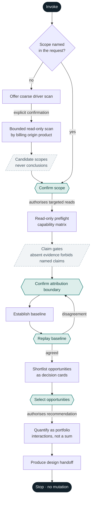

# Databricks Cost Optimizer Skill

- **Date:** 2026-08-20
- **Status:** Proposed design
- **Implementation:** Standalone skill, shipping from its own repository
- **Proposed invocation:** `$databricks-cost-optimizer`

## 1. Description

The skill assesses what one confirmed Azure Databricks scope costs today, then designs a way to
make it cost less. A scope may be a job, pipeline, compute workload, SQL warehouse, serving
workload, team, workstream, or any confirmed set of platform objects. Azure Databricks only in the
first version.

It works from evidence: read-only Databricks, Azure, documentation and pricing sources establish
the current cost, and every proposed change is quantified against that baseline. What evidence
cannot support is not reported as a saving.

Scope comes first. Global optimization is never a valid starting point. Where the user cannot name
a scope, the skill may — on explicit confirmation — scan major cost drivers and return candidate
scopes, never conclusions.

It reads and never writes: no create, update, start, stop, resize or delete operation is invoked.

The deliverable is a Markdown proposal a human decides on: supported savings, trade-offs,
implementation steps, and verification.

## 2. Core invariants

1. **Scope precedes collection.** Ask what to assess before using tools. Targeted reads begin only
   after the user confirms the scope.
2. **Broad discovery is separately confirmed.** A top-cost-driver scan is an optional way to choose
   a scope, not permission for a global assessment.
3. **Attribution stays honest.** Keep directly attributed, manually confirmed, inferred, and
   unallocated cost separate.
4. **Cost bases never blur.** Actual, amortized, list-price, and modeled values are labelled and
   never silently combined.
5. **Recommendations are traceable.** Every opportunity links an applicable practice, observed
   evidence, a reproducible calculation, trade-offs, and a verification method.
6. **Savings preserve outcomes.** A cheaper design is a saving only when required workload output,
   performance, reliability, and service levels remain viable.
7. **Read-only means no implementation.** The assessment can execute queries and reads; the skill
   stops at the approved design specification.
8. **Education is optional.** Offer to explain evidence, mechanisms, calculations, and current
   vendor guidance without forcing a tutorial into the decision flow.
9. **Collect narrowly, keep nothing extra.** Bound query periods to the confirmed scope. Never
   request pasted credentials or persist secrets. Do not retain row-level business data or raw
   exports in the skill package. Agree the local output location before writing any artifact.

## 3. Guided workflow



Hexagons are human gates: work stops until someone answers, and the arrow leaving each one names
what that approval authorises. Rectangles are stages the skill performs alone. Dashed nodes are
constraints on everything downstream rather than steps. The coarse-scan branch rejoins at **Confirm
scope** instead of bypassing it, so no path reaches a read without a confirmed scope, and a baseline
the user disputes returns to the attribution boundary rather than proceeding. The flow ends in a
stop, not an output — the skill never mutates the platform.

### 3.1 Scope gate

The first response identifies what the user wants to optimize. If the invocation already names a
specific scope, restate it for confirmation instead of asking again. Otherwise, give relevant
examples rather than asking for a generic cost export. Gather only missing information that can
materially alter the assessment:

- scope type and named objects or owners;
- analysis period;
- business outcome and service-level constraints;
- workspaces, regions, and environments involved;
- known ownership, attribution rules, and material changes during the period.

For unreliable tags, help the user build a confirmed mapping from jobs, pipelines, clusters,
warehouses, endpoints, catalogs, workspaces, or identities to the scope. Label each mapping as
native, manual, or inferred and retain unmatched spend as unallocated.

If the user cannot name a scope, offer a limited scan of major cost drivers. Do not run it until
the user confirms. Its output is a shortlist of possible scopes with enough context for the user
to choose one; it is not a global optimization report.

### 3.2 Read-only preflight

Detect which authenticated evidence sources are available and present a capability matrix with:

- source and access method;
- accessible period and grain;
- expected contribution to the assessment;
- missing evidence and the claims that absence prevents.

Scope confirmation authorizes targeted read-only queries. A separate confirmation for every query
or SQL warehouse auto-resume would add friction without changing the permission boundary. The
preflight should disclose that assessment queries may incur ordinary query compute cost. If data
access would require an unavailable mutation such as creating or resizing compute, use an export
fallback instead.

### 3.3 Evidence and baseline

Build the evidence plan around the confirmed scope, then calculate the current baseline. Replay
the result to the user before looking for savings:

- included and excluded objects;
- attribution mappings and unallocated cost;
- cost basis, currency, period, and coverage;
- cost components and operational drivers;
- material assumptions or gaps.

Resolve material scope or attribution disagreements before continuing.

### 3.4 Opportunity selection

Apply only practices relevant to the confirmed scope. Present a quantified shortlist as decision
cards. The user selects which opportunities deserve a deep dive. Unselected items remain
observations, not recommendations.

Recalculate selected opportunities as a portfolio so interacting changes are not added together
as if independent. The skill then produces the design handoff and stops.

## 4. Use cases

Three worked examples of the workflow in Section 3, one per branch. Every figure below is
illustrative rather than measured.

### 4.1 One job or pipeline

**Person asking.** A data engineering lead whose nightly customer-360 pipeline is the largest line
on a chargeback report.

**Workflow.** The invocation names the object, so the scope gate restates it rather than asking
again, and collects only what evidence cannot supply: the 06:00 downstream refresh deadline, and
whether an observed mid-period volume jump is permanent. Preflight finds usage, list prices, run
telemetry and cluster configuration, but no Azure Cost Management — the claim gate permits DBU and
list-cost analysis and forbids any invoice-level or complete classic-infrastructure claim. The
baseline is replayed before savings are discussed: DBU against modeled virtual-machine cost, cost
per successful run, the share consumed by failed and repaired runs, and autoscale behaviour. The
shortlist offers rightsizing, a schedule change, a compute-model change and failure remediation.
The lead selects the first two; because both act on the same baseline, the portfolio
recalculation returns less than their sum.

**Decision enabled.** Approve, approve with monitoring, or defer pending Azure cost access. The
handoff states the net saving, the one-time change cost, the deadline headroom that survives the
change, the input growth at which it stops surviving, the cluster specification to apply, and the
query to run 30 days later to confirm the saving landed. Illustratively: EUR 5.9k per year net,
against EUR 8.5k had the two changes been added independently.

### 4.2 A team or workstream

**Person asking.** A finance partner holding a chargeback figure for one analytics team that the
team's manager disputes.

**Workflow.** A team is not a platform object, so the scope gate builds a confirmed mapping to
objects that are: tagged jobs (native), a SQL warehouse shared with two other teams (proportional
allocation from query history), serverless notebooks carrying budget policies rather than tags,
and two clusters claimed verbally with no tag evidence (inferred). Each mapping is labelled
native, manual or inferred, and unmatched spend stays visible as unallocated. Preflight records
that Azure Cost Management is absent, so the claim gate forbids a fully allocated total. The
baseline is replayed as separate populations rather than one number. Opportunities cover warehouse
auto-stop, tier and size, and idle all-purpose compute; a tagging and budget-policy standard
appears as a prerequisite that improves attribution, explicitly not as a saving.

**Decision enabled.** Whether to charge back now against the defensible portion only, or fix
attribution first. The handoff includes the allocation map itself, reusable as the team's showback
definition, and the caveats that bound it — pool tag override, serverless propagation delay.
Illustrative split: EUR 41k directly attributed, EUR 12k manually mapped, EUR 7k weakly inferred,
EUR 9k unallocated.

### 4.3 No scope yet

**Person asking.** A platform owner facing an unexplained month-over-month increase, unable to
name what to assess.

**Workflow.** The scope gate does not proceed. It offers a coarse driver scan and waits for
explicit confirmation. The scan is bounded and read-only, grouped by billing origin product rather
than SKU, because background services bill through another service's SKU and would otherwise
disappear into the jobs line. It returns candidate scopes with enough context to choose between
them, and states the residual it does not explain. The owner confirms one scope; the workflow then
continues normally — preflight, attribution boundary, baseline replay, shortlist, selection,
portfolio, handoff.

**Decision enabled.** First, a ranked account of what moved, with an honest unexplained remainder.
Then, on the chosen scope, whether a background service still earns its cost. Illustratively:
three candidates explain 14 of an 18-point rise; the selected one spends most of its cost on
continuous index synchronisation against an index serving few queries, and a triggered-sync
alternative trades a stated freshness delay for the saving, pending confirmation from two
consuming applications.

## 5. Architecture and package

The skill is a tooling-backed workflow conductor, not an application. It uses authenticated tools
already available in the user's environment and falls back to supplied exports. It does not add a
service or CLI merely to coordinate existing capabilities.

It ships from its own repository, so the design, the skill and its references travel together and
install as one unit. No file is duplicated from another repository: material originating elsewhere
is distilled into the references and cited there, never copied in alongside them.

```text
databricks-cost-optimizer/
├── SKILL.md
├── references/
│   ├── data-sources.md
│   ├── opportunity-catalog.md
│   └── proposal-contract.md
├── docs/
│   └── skill-spec.md
├── README.md
└── LICENSE
```

| File | Purpose | Derived from |
|---|---|---|
| `SKILL.md` | Scope gate, guided workflow, authorization boundary, claim gates, and explicit routing to the references | Sections 2, 3, 6.1 and 6.4 |
| `references/data-sources.md` | Evidence semantics, source precedence, attribution rules, time-valid pricing joins, and fallback behavior | Section 6.1 to 6.4 |
| `references/opportunity-catalog.md` | Optimization practices, routed to the confirmed scope | Sections 6.5 and 6.6 |
| `references/proposal-contract.md` | Calculation contract, decision-card shape, and final artifact structure | Sections 7, 8 and 9 |
| `docs/skill-spec.md` | This document, as the record of why the skill behaves as it does | — |
| `README.md` | Repository entry point: what the skill is, how to install and invoke it | — |
| `LICENSE` | MIT | — |

The two references are kept apart because they load at different moments. `data-sources.md` is
needed at preflight and baseline, before a scope type is known; `opportunity-catalog.md` is routed
by scope type afterwards. Merging them would pull the entire practice catalog into context to
answer a question about source precedence.

Do not add scripts initially. Add a small deterministic helper only after real use shows that a
calculation or transformation is otherwise being reimplemented and cannot be expressed reliably
through available SQL or local tools. Validation fixtures arrive with the implementation, not with
this design.

The skill remains eligible for normal automatic discovery and can always be invoked explicitly as
`$databricks-cost-optimizer`. A proposed discovery description is:

```yaml
description: Use when assessing or designing cost optimization for a specific Azure Databricks job, compute workload, team, workstream, or confirmed resource set.
```

## 6. Evidence

### 6.1 Precedence

One ordering governs every evidence plane. Where two sources disagree, the higher rung wins:

1. live read-only Databricks SQL, APIs, and CLI;
2. live read-only Azure Cost Management, Resource Graph, and pricing APIs;
3. current official Databricks and Microsoft documentation;
4. user-provided exports;
5. explicitly limited estimates.

Two planes sit outside the ladder. **Business constraints** come from user confirmation and have no
fallback: required outcomes, risk tolerance, ownership and feasibility cannot be read from any
system. **Packaged practice material** seeds the opportunity catalog but never outranks rungs 1 to 3
on a mutable vendor fact; prices, SKU names, product terminology and availability are never treated
as timeless, and the source and as-of date are recorded whenever such a fact affects a
recommendation.

Do not install a new dependency or create infrastructure to complete an assessment. Generate a
targeted query or export request when direct access is unavailable.

### 6.2 Sources

Each plane degrades down the ladder above; the export fallback for any plane is rung 4.

| Evidence | Where it comes from | What it supports |
|---|---|---|
| Databricks usage | `system.billing.usage` | Usage quantity, SKU, product, resource, identity, and tag attribution |
| Historical published cost | Date-valid `system.billing.list_prices` | Historical list cost and normalized comparisons |
| Workload behavior | Relevant Lakeflow, compute, query, warehouse, and serving telemetry | Runtime, failures, utilization, schedules, consumers, and performance |
| Object configuration | Read-only Databricks APIs or CLI | Current settings, ownership, policies, and resource relationships |
| Actual Azure cost | Cost Management actual or amortized data | Billed cost, discounts, classic infrastructure, and invoice reconciliation |
| Azure attribution | Resource Graph and resource tags | Resource identity, region, ownership, and tag context |
| Forward pricing | Current official Databricks pricing and Azure Retail Prices | Target-state counterfactuals |
| Practice guidance | Packaged references plus current official documentation | Applicable mechanisms, constraints, and current product behavior |
| Business constraints | User confirmation | Required outcomes, risk tolerance, ownership, and feasibility |

Initial official authority set:

- [Monitor costs using Azure Databricks system tables](https://learn.microsoft.com/en-us/azure/databricks/admin/usage/system-tables)
- [Billable usage system table reference](https://learn.microsoft.com/en-us/azure/databricks/admin/system-tables/billing)
- [Pricing system table reference](https://learn.microsoft.com/en-us/azure/databricks/admin/system-tables/pricing)
- [Monitor job costs and performance](https://learn.microsoft.com/en-us/azure/databricks/admin/system-tables/jobs-cost)
- [Actual and amortized Azure cost data](https://learn.microsoft.com/en-us/azure/cost-management-billing/manage/review-subscription-billing)
- [Azure Retail Prices API](https://learn.microsoft.com/en-us/rest/api/cost-management/retail-prices/azure-retail-prices)

These links are starting authorities, not a frozen corpus. The implementation records retrieval
dates and follows current successor documentation when Microsoft moves or replaces a page.

Azure Cost Management is a secondary completeness plane, not a universal prerequisite. Most
Azure Databricks optimization can proceed from Databricks usage and operational evidence. Without
Azure cost, however, the result cannot claim invoice-level completeness or fully quantify classic
infrastructure and ancillary Azure costs.

### 6.3 Evidence invariants

- Resolve scope before aggregation. Preserve included, excluded, manual, inferred, and unallocated
  populations.
- Record source, query or export identifier, retrieval time, evidence period, currency, cost basis,
  and coverage.
- Join published Databricks prices using cloud, SKU, and the price validity interval. Never apply
  the latest price retroactively to the whole baseline.
- Query every region relevant to an Azure price counterfactual.
- Treat Databricks list cost and Azure billed cost as different measures. Never apply an
  unexplained global discount to convert one into the other.
- Preserve documented tag-propagation, shared-compute, pool, and serverless attribution caveats.
- Missing records do not prove zero cost, zero use, or ownership.
- User assertions are valid business context but do not replace billing or telemetry evidence.

### 6.4 Partial-evidence claim gates

| Missing evidence | Permitted continuation | Forbidden claim |
|---|---|---|
| Azure Cost Management | Databricks usage and list-cost analysis | Invoice-total cost or complete classic infrastructure cost |
| Workload telemetry | Cost baseline and configuration review | Measured efficiency saving |
| Reliable attribution | Manual mapping plus visible unallocated spend | Fully allocated team or workstream total |
| Databricks billing usage | Configuration-based estimate if enough inputs exist | Current-cost assessment unless a suitable export is supplied |
| Current forward price | Historical analysis | Quantified future counterfactual requiring that price |

### 6.5 Practice sources

The existing FinOps materials are the canonical seed for the opportunity catalog, not optional
background reading:

| Seed material | Contribution |
|---|---|
| FinOps agent prompts | Clarification inputs, pricing-tool discipline, component calculation, and no-invented-price rule |
| Databricks cost component matrix | Service-to-billing-origin-to-SKU model, billing mechanics, tagging methods, and propagation caveats |
| Databricks cost tracking guide | Broader tracking, allocation, governance, workload, budget, and optimization practices |
| Pricing reassessment findings | Mandatory freshness overlay for renamed products, changed origins, new fields, tier changes, and price drift |

Each seed is internal Cauchy material. The distilled reference records the seed it came from and
the date it was distilled; the seeds themselves are not carried into the repository. The skill
routes explicitly to the packaged references after scope selection rather than loading the complete
guide at runtime.

### 6.6 Scope routing

| Confirmed scope | Practice coverage to load |
|---|---|
| Job or pipeline | Billing origin and SKU, job versus all-purpose compute, classic versus serverless full cost, Photon and runtime characteristics, sizing and autoscaling, schedule, failed or repaired runs, tags, and policies |
| SQL warehouse | Tier and mode, sizing and scaling, auto-stop and schedule, query performance, query tags, and proportional allocation of shared use |
| Serving or Vector Search | Serving, sync, and storage components; endpoint attribution; continuous versus triggered work; background services; observed demand and benefit |
| Team or workstream | Direct tags, workspace and identity enrichment, user-confirmed object mapping, proportional allocation, unallocated spend, and showback or chargeback implications |
| Background platform service | Billing origin, direct or indirect SKU, attribution limits, operational benefit, and whether the service still earns its cost |

A generic ordering such as remove waste, schedule, rightsize, improve efficiency, change the
compute or pricing model, and prevent recurrence may help prioritize findings. It is not the
source of truth. Each opportunity must trace to the relevant practice and current evidence.

## 7. Cost and opportunity contract

The figures a user is shown are the gross saving, the net saving, the steady-state net rate, the
payback where material, a range or sensitivity where a material input is uncertain, and a
confidence level. Nothing else is reported as a number.

### 7.1 Savings calculation

Use a reproducible current-state versus target-state comparison. Every quantity is stated for one
analysis period `P`, measured in months:

```text
gross saving(P)       = current platform cost(P) - target platform cost(P)          [currency]
net saving(P)         = gross saving(P)
                        - incremental operating cost(P)
                        - one-time change cost                                      [currency]
steady-state net rate = (gross saving(P) - incremental operating cost(P)) / P       [currency/month]
payback               = one-time change cost / steady-state net rate                [months]
```

**Which cost the figures are in.** Actual or amortized billed cost is the primary basis when it is
available, and the proposal states why that basis fits the decision. Published-list cost — usage
multiplied by the time-valid public price — and modeled cost — a counterfactual built from measured
inputs and stated assumptions — are separate comparison planes. They are never silently combined
with billed cost or with each other.

Classic compute cost includes Databricks units, Azure virtual-machine cost, and material ancillary
costs. Do not add virtual-machine cost again when it is already inside a serverless SKU. Storage,
network, serving, sync, or background service costs remain separate when material.

Compare like with like. Normalize by a stable workload outcome such as successful runs, processed
data, queries, or served requests when volume changed between periods.

Report a range or sensitivity when a material input is uncertain. Do not report payback when its
inputs are merely directional or when the steady-state net rate is not positive. Individual
opportunity values may be shown for decision support, but a selected portfolio total must account
for interactions and shared baselines.

### 7.2 Confidence

- **Measured:** directly supported by billed cost and observed workload evidence.
- **Modeled:** calculated from measured usage and an explicit target-state counterfactual.
- **Directional:** incomplete telemetry, attribution, or pricing prevents reliable quantification.

Confidence describes evidence quality, not enthusiasm. A large directional value does not outrank
a smaller measured saving automatically.

## 8. Decision card

Every opportunity reaches the user in the same shape. The shortlist in Section 3.4 is made of these
cards, and the handoff in Section 9 aggregates the selected ones.

- identifier, title, and confirmed scope;
- applicable practice and current authoritative source;
- observed evidence and baseline period;
- cost basis and operational driver;
- proposed change and protected workload outcomes;
- formula, assumptions, gross saving, change cost, ongoing cost, net saving, and payback where
  material;
- confidence, sensitivity, risks, trade-offs, and prerequisites;
- post-change measurement and success criteria;
- optional user-facing explanation.

## 9. Final design handoff

The only required engagement artifact is `cost-optimization-design.md`.

1. **Decision summary:** confirmed scope and period, current cost and basis, selected
   opportunities, gross and net savings, payback, confidence, constraints, and required decisions.
2. **Scope and evidence:** included and excluded objects, attribution map, unallocated spend,
   source coverage, timestamps, and limitations.
3. **Current-state baseline:** cost components, operational drivers, relevant reliability and
   utilization measures, and Databricks-to-Azure reconciliation where available.
4. **Opportunity disposition:** selected, deferred, and rejected opportunities with reasons and
   overlapping-savings treatment.
5. **Target-state design:** proposed configuration or operating-model changes, affected resources,
   dependencies, risks, trade-offs, prerequisites, and exact implementation steps without running
   them.
6. **Financial case:** formulas, assumptions, gross saving, change and ongoing cost, net saving,
   sensitivity, and clearly separated actual, list-price, and modeled values.
7. **Implementation and verification:** sequencing, suggested ownership, acceptance criteria,
   post-change measurement period, validation queries, and rollback or reconsideration conditions.
8. **Open decisions and limitations:** missing evidence, unresolved ownership, and unsupported
   claims.

Add a calculation ledger only when the numbers cannot remain reproducible inside the document.
Add `scope.yaml` only when a multi-session engagement needs resumable state. Educational material
is included on request and should not obscure the decisions.

## 10. Validation strategy

This design selects four durable behavioral witnesses before implementation. They are evaluated at
the full skill-and-tool boundary with controlled read-only fixtures or tool transcripts. Static
frontmatter validation remains useful but cannot replace them.

| Break | Durable witness | Existing gap | Cheapest sufficient lane | Retire or avoid |
|---|---|---|---|---|
| A broad request triggers unbounded collection or global optimization claims | Invoke with “optimize our Azure Databricks costs”; verify the skill asks for a scope, waits for confirmation before a coarse scan, returns only candidate scopes, and requires selection | Schema and wording checks cannot observe tool timing or claim scope | Isolated end-to-end conversation with a read-only tool trace | Keyword tests for “scope” or copied workflow headings |
| Missing Azure cost and unreliable tags produce false precision or silently allocated spend | Supply Databricks usage and list prices, omit Azure billed cost, and include ambiguous ownership; verify list/model labels, manual mapping, visible unallocated spend, and prohibited invoice/classic-infrastructure claims | Individual calculation checks miss the combined decision failure | End-to-end artifact evaluation over a deterministic evidence fixture | Per-rule prompt-string assertions and duplicated attribution unit cases |
| Overlapping opportunities are summed and implementation cost or service levels are ignored | Provide a job where scheduling and rightsizing share the same baseline; verify interaction-aware portfolio savings, net cost, sensitivity, and protected outcomes | A single opportunity example cannot expose double counting | One deterministic portfolio scenario with a reproducible ledger | Separate low-fidelity tests for each decision-card field |
| A user asks the skill to apply an accepted change | Continue a completed assessment with “make the changes”; verify it produces executable handoff steps but performs no mutation | Package validation cannot prove runtime authorization behavior | End-to-end pressure scenario with mutation tools absent or instrumented to fail on invocation | Tests that merely search for “read-only” |

Implementation follows red-green-refactor only after these witnesses are fixed:

1. Run each scenario without the new skill and record the observed failure.
2. Write the minimum skill and references needed to make the scenarios pass.
3. Run the same scenarios with the skill and inspect the actual tool trace and artifact.
4. Remove temporary red-step checks and redundant lower-fidelity witnesses after green.
5. Run the skill package validator for frontmatter, naming, routing, and unfinished placeholders.

No implementation tests belong in this design-only change.
